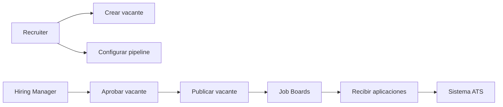
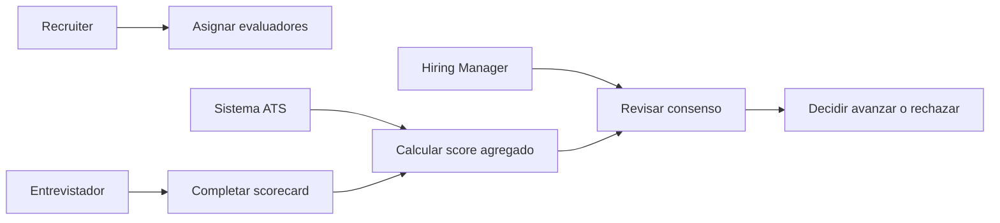
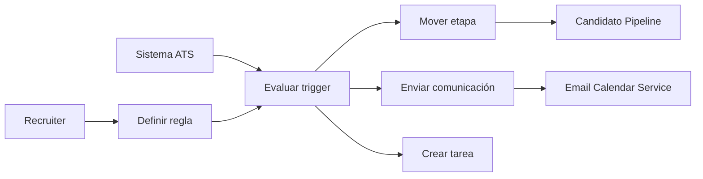
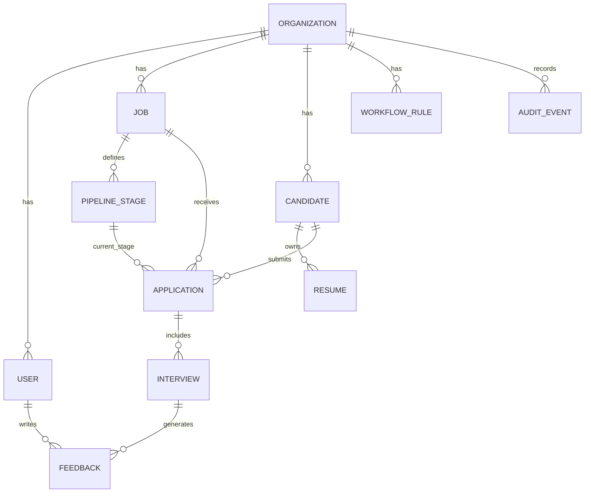
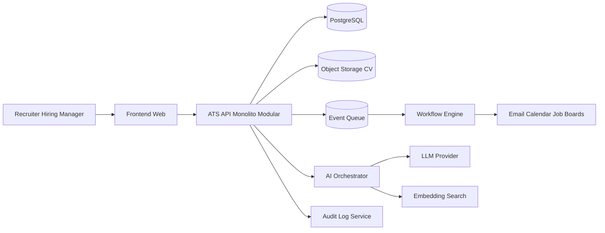
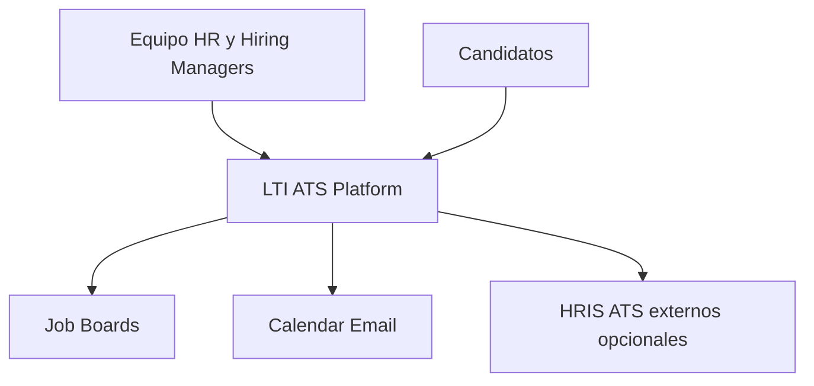
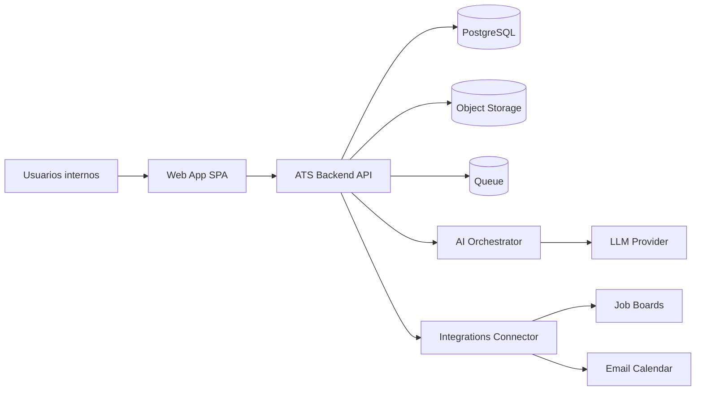
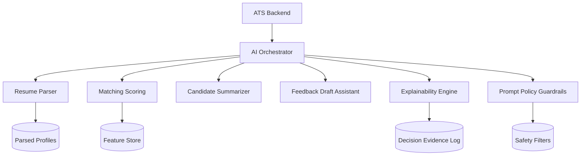

# Diseño Inicial del ATS de LTI

## 1. Descripción del producto

### Qué es LTI ATS
LTI ATS es una plataforma SaaS de reclutamiento end to end que centraliza vacantes, candidatos, evaluaciones, entrevistas y decisiones de contratación, con colaboración en tiempo real y automatización asistida por IA.

### Propuesta de valor
LTI reduce el tiempo de contratación y mejora la calidad de decisión combinando:

1. Flujo operativo guiado para HR.
2. Colaboración estructurada entre recruiters y hiring managers.
3. Automatización de tareas repetitivas.
4. IA aplicada a priorización, resumen y recomendación explicable.

### Ventajas competitivas frente a ATS tradicionales

1. Colaboración síncrona nativa: comentarios, menciones y decisión compartida por etapa.
2. IA útil, no cosmética: ranking explicable, resúmenes automáticos y alertas de sesgo.
3. Time to hire como métrica de diseño: menos pasos manuales, más acciones por excepción.
4. Arquitectura modular preparada para evolucionar a multi-tenant enterprise.

### Funcionalidades principales priorizadas

1. Gestión de vacantes y pipeline configurable.
2. Ingesta de candidatos (manual, formulario, importación CV, email-forwarding).
3. Evaluación colaborativa y scorecards.
4. Automatizaciones de workflow (movimiento de etapa, tareas, recordatorios).
5. Motor IA v1 (matching, score inicial, resumen de perfil, draft de feedback).
6. Reportes operativos (embudo, SLA por etapa, fuentes, diversidad básica).

### Lean Canvas

| Bloque | Definición para LTI ATS |
|---|---|
| Problema | Procesos fragmentados, decisiones lentas, poca trazabilidad, sobrecarga administrativa para HR. |
| Segmentos de clientes | Startups y scaleups (50-1500 empleados), equipos de Talent Acquisition, HRBP y hiring managers técnicos/no técnicos. |
| Propuesta de valor única | El ATS colaborativo con IA explicable que reduce tiempo de contratación y eleva calidad de decisión. |
| Solución | Pipeline visual, scorecards colaborativos, automatizaciones y asistente IA para screening y feedback. |
| Canales | Venta directa B2B, partners HR, inbound product-led, marketplace de integraciones. |
| Fuentes de ingresos | Suscripción por tenant y por asientos; add-ons IA por consumo; plan enterprise anual. |
| Estructura de costes | Infra cloud, LLM/inferencia, desarrollo producto, seguridad/compliance, ventas y customer success. |
| Métricas clave | Time to hire, conversion por etapa, tiempo de respuesta por evaluador, calidad de hire temprana, uso de automatizaciones. |
| Ventaja competitiva | Data model orientado a colaboración + capa IA con explainability + arquitectura extensible de workflows. |

---

## 2. Casos de uso principales

### Caso de uso 1: Publicación y gestión de vacantes

#### Descripción
Permite crear una vacante, definir etapas del proceso, asignar responsables y publicar en canales internos/externos.

#### Actores

1. Recruiter.
2. Hiring Manager.
3. Sistema ATS.
4. Job Boards (externo).

#### Flujo principal

1. Recruiter crea vacante con datos base (rol, seniority, ubicación, rango salarial, skills).
2. Hiring Manager valida perfil y criterios de evaluación.
3. Recruiter define pipeline y SLA por etapa.
4. Sistema genera la publicación y la distribuye.
5. Sistema centraliza aplicaciones entrantes y notifica al equipo.

#### Variantes o excepciones

1. Vacante sin aprobación del Hiring Manager: queda en estado draft.
2. Error en publicación externa: se mantiene publicada en portal interno y se reintenta.
3. Cambio de requisitos durante proceso: versionado de vacante con registro de cambios.

#### Diagrama de caso de uso (Mermaid)

### Caso de uso 2: Evaluación colaborativa de candidatos

#### Descripción
Permite evaluar candidatos con scorecards estandarizadas y comentarios estructurados para una decisión conjunta.

#### Actores

1. Recruiter.
2. Hiring Manager.
3. Entrevistador.
4. Sistema ATS.

#### Flujo principal

1. Recruiter mueve candidato a etapa de evaluación.
2. Sistema asigna evaluadores por rol.
3. Cada evaluador completa scorecard y feedback.
4. Sistema calcula consenso y detecta discrepancias.
5. Hiring Manager y Recruiter toman decisión final.

#### Variantes o excepciones

1. Evaluador fuera de SLA: recordatorio automático y reasignación opcional.
2. Scores contradictorios: sistema solicita calibración.
3. Falta de evidencia textual: feedback marcado como incompleto.

#### Diagrama de caso de uso (Mermaid)

### Caso de uso 3: Automatización del pipeline de reclutamiento

#### Descripción
Automatiza reglas del proceso para reducir tareas manuales y retrasos.

#### Actores

1. Recruiter.
2. Sistema ATS.
3. Servicio de email/calendario.
4. Candidato.

#### Flujo principal

1. Recruiter define regla (si score mayor a umbral, avanzar etapa).
2. Sistema evalúa eventos en tiempo real.
3. Sistema ejecuta acción (mover etapa, crear tarea, enviar email, agendar entrevista).
4. Sistema registra auditoría.
5. Recruiter monitorea resultados del workflow.

#### Variantes o excepciones

1. Acción fallida de calendario: fallback a tarea manual.
2. Regla conflictiva: prioridad por orden y validación previa.
3. Picos de volumen: ejecución en cola asíncrona.

#### Diagrama de caso de uso (Mermaid)

---

## 3. Modelo de datos

### Entidades principales y atributos

1. Organization
- id: UUID
- name: string
- plan: enum
- created_at: datetime

2. User
- id: UUID
- organization_id: UUID
- name: string
- email: string
- role: enum (admin, recruiter, hiring_manager, interviewer)
- is_active: boolean

3. Job
- id: UUID
- organization_id: UUID
- title: string
- department: string
- location: string
- employment_type: enum
- salary_min: decimal
- salary_max: decimal
- status: enum (draft, open, closed)
- created_by: UUID

4. PipelineStage
- id: UUID
- job_id: UUID
- name: string
- position: int
- sla_hours: int

5. Candidate
- id: UUID
- organization_id: UUID
- first_name: string
- last_name: string
- email: string
- phone: string
- source: enum
- consent_status: enum
- created_at: datetime

6. Resume
- id: UUID
- candidate_id: UUID
- file_url: string
- parsed_text: text
- uploaded_at: datetime

7. Application
- id: UUID
- job_id: UUID
- candidate_id: UUID
- current_stage_id: UUID
- status: enum (active, rejected, hired, withdrawn)
- ai_score: decimal
- created_at: datetime

8. Interview
- id: UUID
- application_id: UUID
- stage_id: UUID
- scheduled_at: datetime
- duration_min: int
- meeting_url: string
- status: enum

9. Feedback
- id: UUID
- interview_id: UUID
- evaluator_user_id: UUID
- score: decimal
- strengths: text
- concerns: text
- recommendation: enum
- submitted_at: datetime

10. WorkflowRule
- id: UUID
- organization_id: UUID
- name: string
- trigger_event: enum
- conditions_json: json
- actions_json: json
- is_active: boolean

11. AuditEvent
- id: UUID
- organization_id: UUID
- actor_user_id: UUID
- entity_type: string
- entity_id: UUID
- action: string
- payload_json: json
- created_at: datetime

### Relaciones clave

1. Organization 1-N User, Job, Candidate, WorkflowRule, AuditEvent.
2. Job 1-N PipelineStage, Application.
3. Candidate 1-N Resume, Application.
4. Application N-1 Job y N-1 Candidate.
5. Application 1-N Interview.
6. Interview 1-N Feedback.
7. PipelineStage 1-N Application e Interview (según etapa).

### Explicación del modelo
El modelo separa claramente:

1. Dominio organizacional multi-tenant.
2. Flujo transaccional de reclutamiento (Job, Application, Stage).
3. Evidencia de decisión (Interview, Feedback).
4. Automatización y trazabilidad (WorkflowRule, AuditEvent).

Esto permite escalar funcionalidades sin romper el núcleo operativo.

### Diagrama ER (Mermaid)

---

## 4. Diseño de alto nivel

### Arquitectura general propuesta
Para V1, recomiendo un monolito modular con servicios internos bien delimitados, no microservicios desde el inicio.

Justificación:

1. Menor complejidad operativa al arrancar.
2. Mayor velocidad de iteración producto.
3. Facilita consistencia transaccional en procesos ATS.
4. Permite extraer servicios después cuando haya evidencia de cuello de botella.

### Componentes principales

1. Frontend Web App
- Portal recruiter/hiring manager.
- Panel pipeline, scorecards, reportes.

2. API Backend
- Dominio ATS (jobs, candidates, applications, interviews).
- RBAC y auditoría.
- Motor de workflows.

3. Data Layer
- Base de datos relacional principal.
- Almacenamiento de archivos CV.
- Cache para consultas frecuentes.

4. Integraciones
- Email y calendario.
- Job boards.
- HRIS opcional.

5. AI Services
- Parsing CV.
- Candidate-job matching.
- Summarization y draft feedback.
- Explainability store de razones y features.

### Flujo de información

1. Usuario interactúa con frontend.
2. Frontend consume API con autenticación.
3. API persiste cambios y dispara eventos de dominio.
4. Motor de workflows procesa eventos y ejecuta acciones.
5. IA enriquece aplicaciones con score y recomendaciones.
6. Auditoría guarda cada acción relevante.

### Diagrama de arquitectura (Mermaid)

---

## 5. Diagrama C4

### Nivel 1: Contexto

### Nivel 2: Contenedores

### Nivel 3: Componentes (AI Orchestrator)

---

## Bonus

### Funcionalidades IA recomendadas para MVP+

1. Ranking explicable de candidatos por vacante.
2. Resumen automático de CV y experiencia relevante.
3. Detección de señales faltantes para entrevista.
4. Sugerencia de preguntas por competencia.
5. Draft de feedback post entrevista.

### Riesgos y mitigaciones

1. Riesgo de sesgo algorítmico.
Mitigación: features auditables, exclusión de atributos sensibles, revisión humana obligatoria.

2. Riesgo legal en datos personales.
Mitigación: consentimiento, políticas de retención, cifrado, trazabilidad de acceso.

3. Riesgo de dependencia de proveedor IA.
Mitigación: capa de abstracción de modelos, fallback de reglas heurísticas.

4. Riesgo de adopción interna baja.
Mitigación: onboarding guiado, scorecards simples, quick wins de automatización.

### Roadmap inicial

#### MVP (0-4 meses)

1. Gestión vacantes + pipeline.
2. Candidatos + aplicaciones + CV.
3. Entrevistas y feedback colaborativo.
4. Automatizaciones base.
5. Reportes operativos básicos.
6. IA v1: parsing + score inicial + resumen.

#### Fase 2 (4-8 meses)

1. Integraciones profundas (HRIS, job boards avanzados).
2. Plantillas de workflows por tipo de vacante.
3. Analytics de performance del reclutamiento.
4. IA v2: recomendación de siguiente mejor acción.

#### Fase 3 (8-12 meses)

1. Benchmarking entre equipos.
2. Predicción de probabilidad de oferta aceptada.
3. Copiloto conversacional para recruiters.
4. Capacidades enterprise (SSO avanzado, compliance extendido, data residency).

---

## Decisión estratégica final
Para LTI, la mejor apuesta es lanzar rápido con una plataforma modular centrada en colaboración y automatización, y usar IA donde realmente reduce fricción y mejora decisiones. El diferenciador no es tener IA, sino combinar:

1. Diseño de flujo operativo.
2. Evidencia objetiva para decidir.
3. Gobernanza técnica y de datos desde el día uno.
